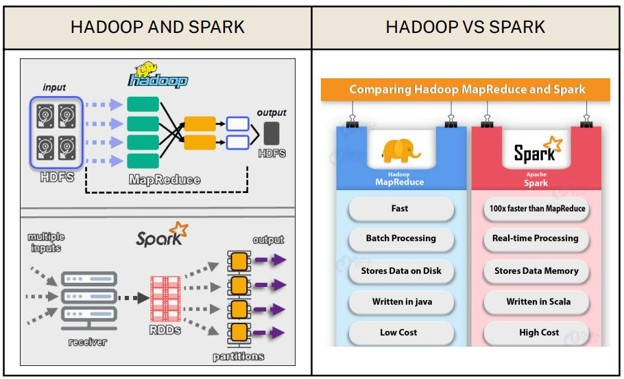
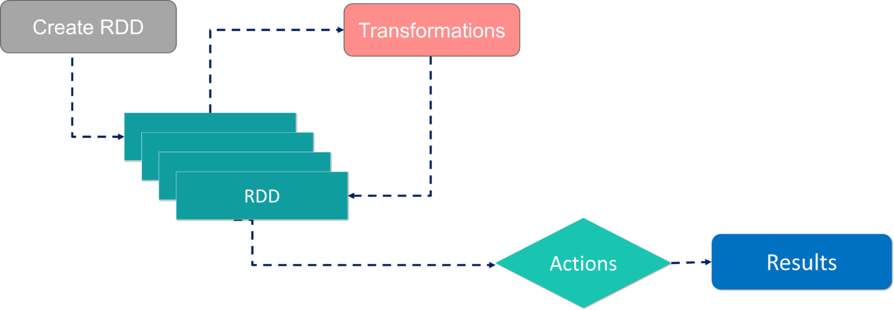

# Apache Spark

## What is Spark?



Apache Spark is a distributed data processing engine that uses DAG-based execution, in-memory computation, and parallel processing.

---

## RDD (Resilient Distributed Dataset)



### RDD Characteristics

- Resilient
- Distributed
- Dataset
- Immutable
- Fault-Tolerant

---

## Lazy Evaluation


collect()
first()
max()
reduce()
```

---

## DAG (Directed Acyclic Graph)

![DAG ges/dag.png

### Components

- Directed
- Acyclic
- Graph

---

## Spark Features

![Spark Featuresfeatures.png

### Features

- Speed
- In-Memory Processing
- Caching
- Real-Time Processing
- Scalability
- Multi-Language Support

---

## Spark Driver

![/images/spark-driver.png

Responsibilities:

- Creates SparkContext
- Schedules Jobs
- Monitors Execution
- Collects Results

---

## Spark Ecosystem

![Spark Ecosystemcosystem.png

Components:

- Spark Core
- Spark SQL
- Spark Streaming
- MLlib
- GraphX

---

## Spark Architecture


```python
df.cache()
```

Stores data in:

- MEMORY_ONLY

### persist()

```python
df.persist()
```

Supports:

- MEMORY_ONLY
- MEMORY_AND_DISK
- DISK_ONLY
- OFF_HEAP

---

# Catalyst, AQE and Tungsten

![Catalyst AQE Tungsten](../images/cataleature | Catalyst | AQE | Tungsten |
|----------|----------|----------|----------|
| Stage | Planning | Runtime | Execution |
| Focus | Optimization | Adaptation | Performance |

---

# Unity Catalog

![Unityes/unity-catalog.png

```text
Metastore
│
└── Catalog
    │
    └── Schema
        ├── Tables
        ├── Views
        ├── Volumes
        └── Functions
```

---

# Volumes

![Unity Catalog Volumes-volumes.png

Used for:

- CSV Files
- JSON Files
- PDFs
- Images
- ML Models

---

# Lineage

![Unity Catalog Lineage]lineage.png

```text
Source Table
      ↓
Silver Table
      ↓
Gold Table
      ↓
Dashboard
```

---

# Enterprise Unity Catalog Design

![Enterprise Unity Catalog](../imagesg

```text
Metastore
│
├── sales_catalog
├── finance_catalog
└── marketing_catalog
```

---

# Summary

![Spark Summary](..ng

Apache Spark provides:

- Distributed Processing
- DAG Execution
- Fault Tolerance
- In-Memory Computing
- Scalability
- High Performance

Unity Catalog provides:

- Governance
- Security
- Lineage
- Auditing
- Data Sharing
