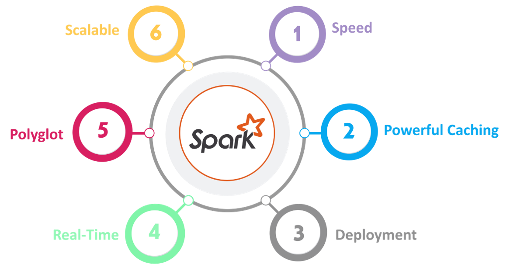

# Apache Spark

## What is Spark?


Apache Spark is a distributed data processing engine that uses DAG-based execution, in-memory computation, and parallel processing.

---

## RDD (Resilient Distributed Dataset)


### RDD Characteristics

- Resilient
- Distributed
- Dataset
- Immutable
- Fault-Tolerant

---

## Lazy Evaluation


RDD operations are categorized into:

- Transformations
- Actions

---

## Transformations

![Transformationsrmations.png

### Narrow Transformations


Examples:

- map()
- filter()
- flatMap()

### Wide Transformations


Examples:

- reduceByKey()
- join()
- distinct()
- groupByKey()

---

## Actions


```python
count()
collect()
first()
max()
reduce()
```

---

## DAG (Directed Acyclic Graph)

### Components

- Directed
- Acyclic
- Graph

---

## Spark Features



### Features

- Speed
- In-Memory Processing
- Caching
- Real-Time Processing
- Scalability
- Multi-Language Support

---

## Spark Driver

![/images/spark-driver.png

Responsibilities:

- Creates SparkContext
- Schedules Jobs
- Monitors Execution
- Collects Results

---

## Spark Ecosystem

Components:

- Spark Core
- Spark SQL
- Spark Streaming
- MLlib
- GraphX

---

## Spark Architecture


```python
df.cache()
```

Stores data in:

- MEMORY_ONLY

### persist()

```python
df.persist()
```

Supports:

- MEMORY_ONLY
- MEMORY_AND_DISK
- DISK_ONLY
- OFF_HEAP

---

# Catalyst, AQE and Tungsten

![Catalyst AQE Tungsten](../images/cataleature | Catalyst | AQE | Tungsten |
|----------|----------|----------|----------|
| Stage | Planning | Runtime | Execution |
| Focus | Optimization | Adaptation | Performance |

---


# Summary

![Spark Summary](..ng

Apache Spark provides:

- Distributed Processing
- DAG Execution
- Fault Tolerance
- In-Memory Computing
- Scalability
- High Performance
